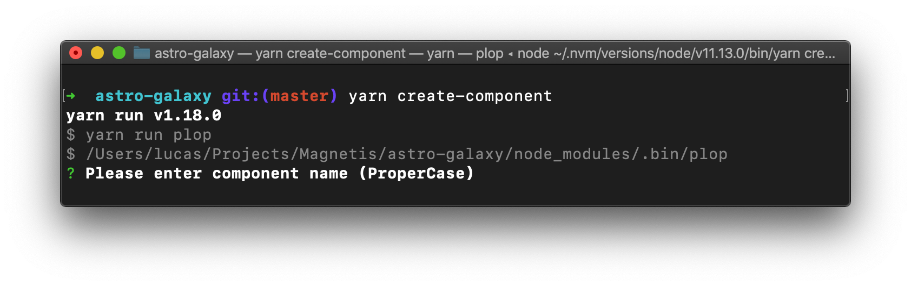
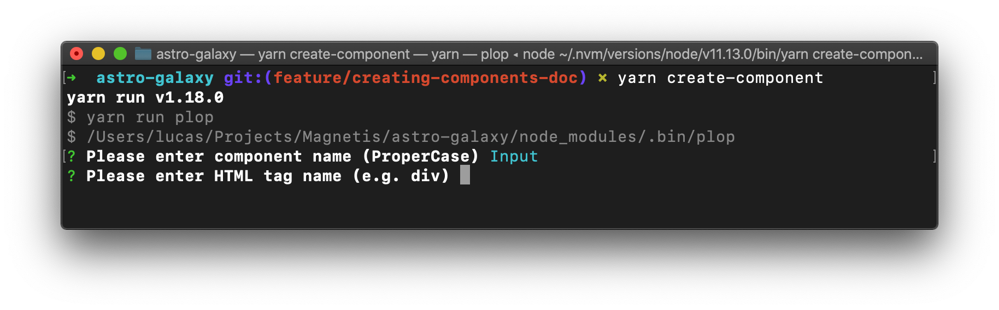
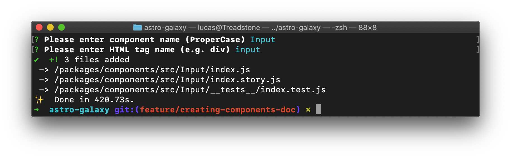

# Creating components

This document's goal is to provide a tutorial on how to create components for Astro Galaxy.

To get started, please follow the instructions in our [CONTRIBUTING.md](CONTRIBUTING.md) guide first.

From now on, we are assuming that you already has everything set in your local environment.

- [Creating your first component](#creating-your-first-component)
- [Start coding](#start-coding)
- [Tests](#test)
- [Storybook](#storybook)

### Creating your first component

Let's say you want to create an `input` text component. As you already know by reading our `CONTRIBUTING` guide, we provide a way to scaffold the components (using [Plop](https://plopjs.com/)) so you don't have to worry about creating folder and files. With that being said, run the follow command in your terminal:

```sh
yarn create-component
```

You will be prompt with the following:



Enter the name of your component, in our case let's call it `Input`, and hit enter. Now another option will appear:



Our component is an `input` and we will be using an `input` HTML tag, let's type that and hit enter again.

If everything works as expected, you should see something like the following:



Three files were created inside `packages/components/src/Input`:

- `index.js`: This is our component's main file.
- `index.story.js`: This is our component's Storybook story.
- `__tests__/index.test.js`: This is our component's test file.

### Start coding

Let's open our newly created `index.js` file, we should have something like this:

```js
import styled from 'styled-components';
import { space } from 'styled-system';

const Input = styled.input``;

Input.displayName = 'Input';

Input.propTypes = {};

export default Input;
```

For Astro Galaxy, we are using `css-in-js` with [`styled-components`](https://www.styled-components.com/) and [`styled-system`](https://styled-system.com/).

Styled System plays an important role in our workflow, as it allow us to build components with constraint-based styled props based on scales defined in our theme.

We strongly recommend that you read at least the basics of Styled System in their website, but for now all you need to know is the key references used via props by Styled System, mapped to our theme file. You can view the table in [this link](https://styled-system.com/theme-specification#key-reference).

Let's add some styles to our component:

```js
const Input = styled.input`
  width: 100%;
  background-color: ${props => props.theme.colors.space100};
  border-radius: ${props => props.theme.radii[2]};
`;
```

Note how we are accessing our theme values by theme props. For the `border-radius` style key, we are accessing the `radii` key number 2 of our theme `radii` property, if you look at our theme, you will see the following:

```js
radii: [0, 2, 8, 16, 24, 32],
```

As you can see, we are using the value 8 for `border-radius`.

If you face any problems using this approach of accessing the prop theme inside our style, you can always import the theme itself like so:

```js
import { webTheme } from '@magnetis/astro-galaxy-themes';
```

Once you finish coding your component, you should export it in `packages/components/src/index.js` like so:

```js
export { default as Input } from './Input';
```

### Tests

For tests, we use Jest with Snapshots and also [`jest-dom`](https://github.com/testing-library/jest-dom).

By default, the test file previously automatically created contains the follow:

```js
import React from 'react';

import Input from '../index';

describe('Input', () => {
  it('should render', () => {
    const json = rendererCreateWithTheme(<Input />).toJSON();

    expect(json).toMatchSnapshot();
  });
});
```

Tests are relative, but let's add a hypothetical test case where we want to check if our component has a specific css rule with a specific value.

```js
it('should have a white background-color', () => {
  const json = rendererCreateWithTheme(<Input />).toJSON();

  expect(json).toHaveStyleRule('background-color', '#fff');
});
```

### Storybook

At the moment, we are using Storybook for isolated development, meaning all our components has their own story and they should be developed and tested in isolation.

When you create your component, you are provided with a storybook file, it should contain something like this:

```js
import React from 'react';
import { storiesOf } from '@storybook/react';
import Input from './index.js';

storiesOf('Input', module).add('default', () => <Input />);
```

You are free to modify this however you like, as long as it supported by Storybook. Below you can find a more complex example used by `Button` component:

```js
storiesOf('buttons', module)
  .add('button default', () => <Button>uranus</Button>)
  .add('primary buttons variants', () => (
    <React.Fragment>
      <Button variant="primary.uranus">uranus</Button>
      <Button variant="primary.earth">earth</Button>
      <Button variant="primary.venus">venus</Button>
      <Button variant="primary.mars">mars</Button>
      <Button disabled>disabled</Button>
    </React.Fragment>
  ));

storiesOf('button sizes', module).add('primary buttons sizes', () => (
  <React.Fragment>
    <Button buttonSize="small">small</Button>
    <Button buttonSize="medium">medium ~ default</Button>
    <Button buttonSize="large">large</Button>
  </React.Fragment>
));
```
